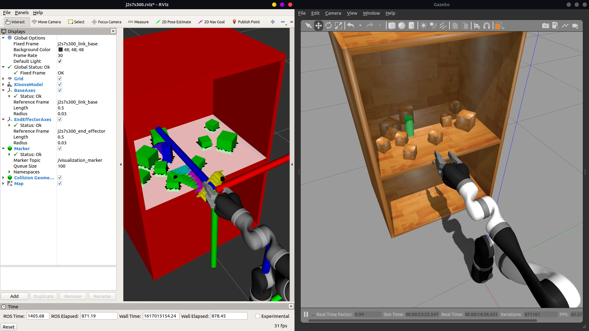

- [Robotic Manipulation Planning in Cluttered Environments](#robotic-manipulation-planning-in-cluttered-environments)
  - [Dependencies](#dependencies)
    - [Required](#required)
    - [Optional](#optional)
  - [Parameters](#parameters)
    - [Gazebo Parameters](#gazebo-parameters)
    - [Planner Parameters](#planner-parameters)
  - [Visualisation](#visualisation)
    - [Rviz](#rviz)
    - [Gazebo Geometries Plugin](#gazebo-geometries-plugin)
  - [Running a Demo](#running-a-demo)
    - [Building](#building)
    - [Gazebo](#gazebo)
    - [Planner](#planner)
  - [Third Party Packages](#third-party-packages)
    - [gazebo_grasp_plugin and gazebo_version_helpers](#gazebo_grasp_plugin-and-gazebo_version_helpers)
    - [Kinova packages](#kinova-packages)
  - [Changes to Jaco2 Models](#changes-to-jaco2-models)
    - [Finger Tips For All Models](#finger-tips-for-all-models)
    - [6-DoF Spherical Wrist Jaco](#6-dof-spherical-wrist-jaco)

# Robotic Manipulation Planning in Cluttered Environments
This repository contains the source code for the MECH3895 3rd year project "Robotic Manipulation Planning" at the University of Leeds.  

## Dependencies
Development was done using ROS Melodic on Ubuntu 18.04.

### Required
- Eigen3
- OMPL (from source or ROS)
- Flexible Collision Library (FCL)
- Gazebo
- TRAC_IK

**NOTE:** Other dependency ROS packages should already be available through a normal desktop install, but you may encounter a missing dependency error for the effort-joint-controller package. If so, then install it manually using:

```
$ sudo apt-get install ros-<distro>-effort-controllers
```

Replace ```<distro>``` with the ROS distro that is installed.

### Optional
These are only for plotting the solution paths if needed.

- gnu plot  
**OR**
- Matplotlib

## Parameters
There are two parameters files, one for [Gazebo](kinova_gazebo/params/gazebo_params.yaml) and one for the [planner](planner/params/params.yaml).

### Gazebo Parameters
- ```gazebo/static_objects``` - string array containing which objects are to be considered static, these will be displayed in red in Rviz.
- ```gazebo/pub_arm_geom``` - bool to trigger visualisation of the Kinova's collision boxes in Rviz. (purely visual, doesn't affect anything)
- ```gazebo/surface``` - the name of the surface that is being worked, this is set during launch. (Check the [demo](#running-a-demo) section for details on launching)

### Planner Parameters
- ```planner/name``` - name of the sampling motion planner to be used.
- ```planner/global_timeout``` - total timeout for planning + execution time in clutter.
- ```planner/timeout``` - timeout duration for the planner.
- ```planner/path_states``` - number of states to be interpolated in generated paths.
- ```planner/save_path``` - bool to trigger saving of solution paths in [paths directory](planner/paths).
- ```planner/propagate_push``` - bool to enable/disable validation of push actions by propagating arm and object states.
- ```planner/use_grasping``` - bool to enable/disable grasping actions.
- ```planner/fix_grasp_pose``` - bool to enable/disable changing of grasp orientation when needed.
- ```kinematics_solver/type``` - solve type for the TRAC_IK solver.
- ```kinematics_solver/timeout``` - solver timeout duration.

## Visualisation
### Rviz
An Rviz node is used to visualise the data that is being used (such as object geometries) and processed data (planner paths).

The paths are visualised by arrows. Each arrow indicates a waypoint in the path and its pose is the same as the end-effector pose for that waypoint (the arrows point in the z-axis direction of the end-effector as this is the axis that indicates the pointing direction).

When planning in clutter, the arrows have different colour due to the path being divided into sub-paths for different actions (move, push, reset etc.).

Additionally, the goal object is displayed in blue, and the final goal state for the path(s) is displayed with a black point.

**NOTE:** The markers will not appear again if unchecked in Rviz, this is because they are published once per plan.  

An example is shown below.  


### Gazebo Geometries Plugin
This is a world plugin that was made to obtain collision geometries of all the objects. The geometries are all obtained as box shapes even if the object itself is not a box, this is to simplify the collision detection process. The geometries are visualised in Rviz by this plugin.

The plugin attempts to get Object Oriented Bounding Boxes (OOBB), if it is unable to, Axis Aligned Bounding Boxes (AABB) are obtained instead.

Check the [plugin folder](gazebo_geometries_plugin/) for more information on its functionality.

## Running a Demo
To run a demo, first clone the repo into a catkin workspace, make sure your terminal is in the src directory:

### Building
```
$ git clone https://github.com/moustafa-m/clutter_planning.git
```

Now build:

```
$ cd .. && catkin_make && source devel/setup.bash
```

If using the [Catkin Tools](https://catkin-tools.readthedocs.io/en/latest/) package:

```
$ catkin build planner_proj && source ../devel/setup.bash
```

### Gazebo
To launch Gazebo, use:

```
$ roslaunch kinova_gazebo robot_launch.launch
```

A Gazebo and Rviz windows should popup.

If desired, you can pass in a world argument to launch a different scene from the [worlds](kinova_gazebo/worlds) folder. The default is ```kinova_table```.
```
$ roslaunch kinova_gazebo robot_launch.launch world:=kinova_cabinet surface:=cabinet_link_middle_plate
```

for more info on obtaining surface names from Gazebo, check the gazebo_scene_randomiser_plugin [README](gazebo_scene_randomiser_plugin/README.md).  
As a starting point you can use the below surface names for each world file in this repo.

- kinova_table - small_table_link_surface (this is the default)
- kinova_shelf - bookshelf_link_low_shelf
- kinova_cabinet - cabinet_link_middle_plate

**NOTE:** if Gazebo models need to be installed, Gazebo node may not launch correctly. Gazebo will take some time to load as it is downloading required models, once loaded the arm will probably just fall due to controller timeout. Resolved by relaunching after Gazebo finishes downloading models and loads up.  

### Planner
Finally, run the planner using:

```
$ roslaunch planner planner.launch
```

The arm will not do anything until a planning request for a specific target is sent. To start planning for a target, use:

```
$ rosservice call /start_plan "target: 'object_name'" 
```

Replace ```object_name``` with the name of an object in Gazebo. This must be a non-static object. As a start use ```cylinder``` which is the green cylinder in the world files in this repo.

Alternatively, you can use the testing node to perform multiple runs:

```
$ roslaunch planner tester.launch num_runs:=number
```

Replace ```number``` with the number of runs you want to do.

## Third Party Packages
All third party licenses can be found in their respective folders in this repository and their original repositories linked below.

### gazebo_grasp_plugin and gazebo_version_helpers
Cloned from [gazebo-pkgs](https://github.com/JenniferBuehler/gazebo-pkgs) repo by [Jennifer Buehler](https://github.com/JenniferBuehler). The master branch was cloned, commit baf0f033475c3a592efb0862079f3ff8392cadf6.  

The grasp_plugin package is used as a workaround to limitations in Gazebo for grasping operations (objects tend to slip/get pushed away when a grasp is attempted). Adding very high friction to the Kinova fingers is also a workaround, although objects may seem to "stick" to the fingers during interactions that are not necessarily grasps. Another change was done to the Kinova description files regarding the finger tips is explained in the next section.

### Kinova packages
The [kinova_control](kinova_control/), [kinova_description](kinova_description/), and [kinova_gazebo](kinova_gazebo) packages are from the official [kinova-ros](https://github.com/Kinovarobotics/kinova-ros/tree/master) package by [Kinova Robotics](https://github.com/Kinovarobotics). The master branch was cloned, commit 99ac039028855eb9c1000a9c51b9c1544d5ef446.

## Changes to Jaco2 Models
### Finger Tips For All Models
The Kinova's finger tips in the description files have been changed to be a fixed joint and disabled in the controller configs.  

The joints would sporadically move when a grasp is attempted and often resulted in the grasp plugin not working correctly and the object being pushed away regardless of set friction values.

A [file](kinova_description/urdf/kinova_finger_friction.xacro) was made to add custom friction values to both parts of the finger sets as well.  

To use these friction values, launch Gazebo with the ```finger_friction``` argument as shown below:
```
$ roslaunch kinova_gazebo robot_launch.launch finger_friction:=true
```

### 6-DoF Spherical Wrist Jaco
The P gain for joint 6 on these models was reduced to 200 from 500. This is due to the joint shaking uncontrollably sometimes.
