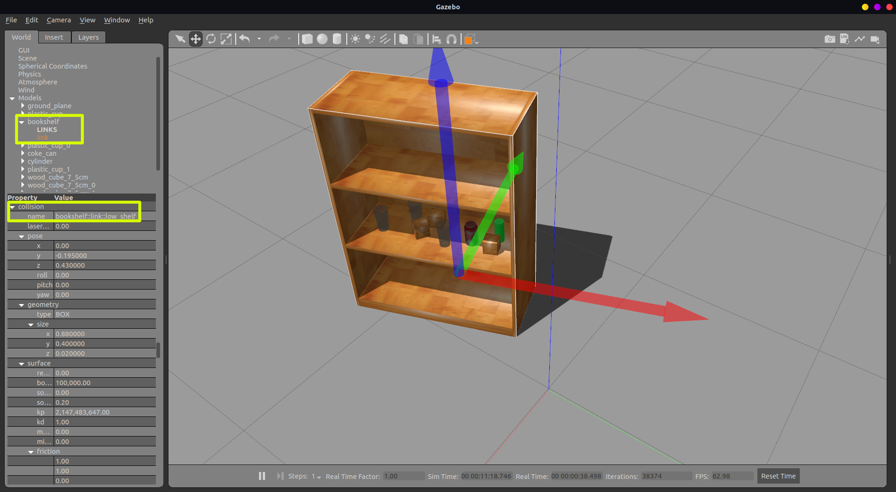

# Gazebo Scene Randomiser Plugin
A plugin to randomise objects in the world on a given surface. Objects that have the ```static``` attribute enabled in Gazebo are unaffected, you can determine this by selecting a model and checking the left-side panel for the ```static``` attribute.

This plugin was developed while working on a 3rd Year Project at the University of Leeds for manipulation planning in cluttered environments.

User's interface with the plugin is through a ROS service. The plugin takes in the name of a collision link (the surface) and randomises the pose of all the 
objects in the world on that surface. For position, the x and y values are changed, and for rotation, the z-axis rotation (yaw) is changed.

**IMPORTANT:** Make the surface has its z-axis aligned with the world z-axis and has the same direction. The surface yaw can be changed, but roll and pitch must be zero.

The robot name must be set as a parameter on ```/robot_name``` so that the plugin can avoid changing the robot pose.

To include this plugin in a Gazebo world, you will need to include it in the .world file inside the ```<world>``` tag.  
As an example:
```
<world>
    <plugin name='libgazebo_scene_randomiser_plugin' filename='libgazebo_scene_randomiser_plugin.so'/>
</world>
```

## Usage
The plugin service is advertised on ```/gazebo/randomise_scene``` and it takes one parameter, ```surface```, which is the name of the surface.

If using through the command line, simply use:
```
rosservice call /gazebo/randomise_scene "surface: 'name'"
```

Replace ```name``` with the name of a surface. For example, the table model in Gazebo would be ```table_link_surface``` or for one of the shelves on a bookshelf model, ```bookshelf_link_low_shelf```.

To get the name from Gazebo, select the model then in the left side panel, expand the tree and click on "link". In the bottom menu, expand the links tree and search for the desired link.

As an example, the image below shows the required z-axis orientation and objects placed on the "low_shelf" collision link.



## Demo
A demo is shown below of how the plugin works.

